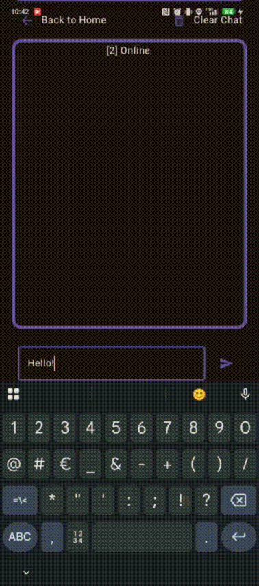
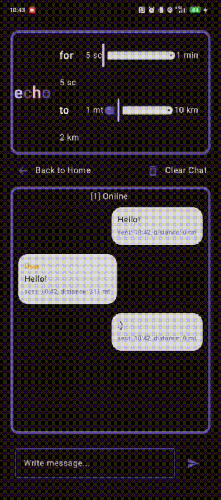

# 🌍 GeoChat

This application leverages the [**Collektive**](https://github.com/Collektive/collektive) **library** to model a decentralized communication system based on spatial proximity. Connected devices can send and receive messages within a global chat, provided they are within a certain distance of each other.




It is possible to send duplicate messages (e.g., the same text sent multiple times in a row), but recipients will only receive each unique message once. That is, a device that has already received a given message will not receive it again, even if it is sent multiple times.



The chat is automatically reset every 5 minutes, meaning that previously displayed messages are cleared from the user interface.

A simulation of this application is available in the companion repository [**GeoChat-Simulation**](https://github.com/Danix002/collektive-examples/tree/feat/GeoChat).

# 🔄 MQTT Broker Information

This application **currently uses the public broker** provided by **EMQX** at: `broker.emqx.io`.

However, the app was developed and tested using a **local Mosquitto broker**.  
If you prefer to run your own broker locally (recommended for development), follow the tutorial below to install and configure **Eclipse Mosquitto**.

## How To Run
- Install Mosquitto 
- Change IP_HOST value in:
  - [MessagesViewModel.kt](app/src/main/java/it/unibo/collektive/viewmodels/MessagesViewModel.kt) 
  - [NearbyDevicesViewModel.kt](app/src/main/java/it/unibo/collektive/viewmodels/NearbyDevicesViewModel.kt)

## 🧪 Local MQTT Broker For Development

This guide explains how to install and run a **local MQTT broker** using **Eclipse Mosquitto**.

---

### ✅ Goal

Install a local MQTT broker accessible at `localhost:1883`.

---

### 🧰 Installing Mosquitto

#### 🔹 Windows

1. Go to [mosquitto.org/download/](https://mosquitto.org/download/)
2. Find the **Windows** section
3. Download:  
   `mosquitto-2.x.x-install-windows-x64.exe`
4. During installation:
    - ✅ Enable **“Install service”**
    - ✅ Use a default path (`C:\Program Files\mosquitto`)
    - ✅ Insert `C:\Program Files\mosquitto` path in to environment variables of the system

#### 🔹 Linux (Debian/Ubuntu)

```bash
    sudo apt update
    sudo apt install mosquitto mosquitto-clients
```

### 🚀 Running The Broker

#### ▶️ Windows

```shell
    mosquitto -v -c "mosquitto/config/mosquitto.conf"
```
Don't close the terminal where you ran this command.

Then open a terminal with administrator privileges and run:
```shell
   net start mosquitto
```

To stop:
```shell
   net stop mosquitto
```

#### ▶️ Linux

Copy your configuration file to the Mosquitto config directory:
```bash
   sudo cp mosquitto/config/mosquitto.conf /etc/mosquitto/mosquitto.conf
```
Don't close the terminal where you ran this command.

Start the Mosquitto service:
```bash
    sudo systemctl start mosquitto
```

To enable Mosquitto to start at boot:
```bash
    sudo systemctl enable mosquitto
```

✅ Verify

Windows:
```shell
    netstat -aon | findstr 1883
```

Linux:
```bash
    ss -tulpn | grep 1883
```